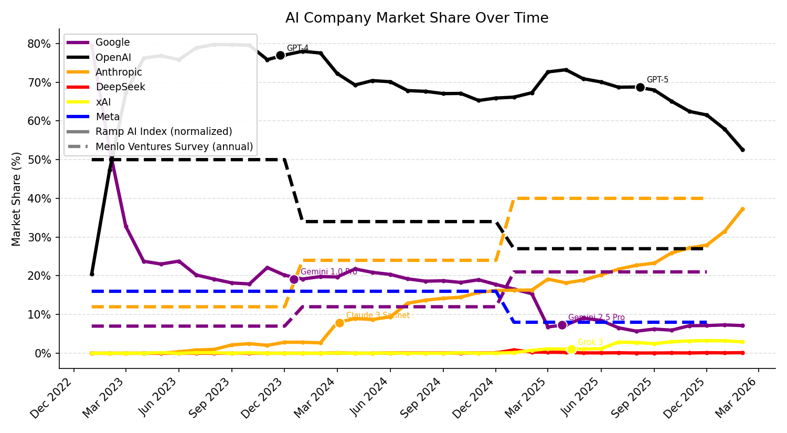

# Top 10 AI Models by Training Cost

Models ranked by training compute cost (2023 USD), filtered to those with a known training cost.
Parameters and Training Dataset Size are shown where available.

| Rank | Model | Organization | Publication Date | Parameters | Training Dataset Size | Training Cost (2023 USD) |
|------|-------|--------------|-----------------|------------|----------------------|--------------------------|
| 1 | Grok 4 | xAI | 2025-07-09 | 3.0T | - | $387.8M |
| 2 | GPT-4.5 | OpenAI | 2025-02-27 | - | - | $340.0M |
| 3 | Grok 3 | xAI | 2025-02-17 | 3.0T | - | $217.8M |
| 4 | Llama 3.1-405B | Meta AI | 2024-07-23 | 405.0B | 15.6T | $52.9M |
| 5 | Llama 4 Behemoth (preview) | Meta AI | 2025-04-05 | 2.0T | 30.0T | $44.6M |
| 6 | GPT-4 (Mar 2023) | OpenAI | 2023-03-15 | 1.8T | 5.4T | $37.3M |
| 7 | Grok-2 | xAI | 2024-08-13 | - | - | $31.6M |
| 8 | Gemini 1.0 Ultra | Google DeepMind | 2023-12-06 | - | - | $30.7M |
| 9 | Claude 3.5 Sonnet | Anthropic | 2024-06-20 | - | - | $25.9M |
| 10 | Nemotron-4 340B | NVIDIA | 2024-06-14 | 340.0B | 9.0T | $21.3M |

*Data source: Epoch Database – Notable Models. 179 models had a known training cost.*

## AI Company Market Share by Survey Source

| Company | Menlo Ventures Survey (Nov 2025) | OpenRouter 2025 revenues | Ramp AI Index normalized (Jan 2026) | Ramp spend share (2026Q1) | a16z CIO Survey LLM spend (Jan 2026) | Artificial Analysis normalized (H1 2025) | CBA API Spend (Jun–Nov 2025) | Revenue 2025 Est. (USD) |
|---------|----------------------------------|--------------------------|-------------------------------------|---------------------------|--------------------------------------|------------------------------------------|------------------------------|-------------------------|
| Anthropic | 40% | 65.8% | 37.3% | 52.2% | 17% | 14.3% | $548,000 | $3.0B |
| OpenAI | 27% | 10.3% | 52.5% | 46.8% | 56% | 17.9% | $1,165,000 | $14.0B |
| Google | 21% | 13.8% | 7.18% | — | 16% | 17.1% | — | — |
| Meta | 8% | — | — | — | 5% | 9.0% | — | — |
| xAI | — | 5.0% | 2.9% | 0.9% | — | 6.6% | — | — |
| DeepSeek | — | 1.6% | 0.2% | — | — | 11.3% | — | — |

*Sources: Menlo Ventures Survey; OpenRouter revenue data collected from OpenRouter and filtered to 2025; Ramp AI Index (shares normalized from summed adoption across reported companies); Ramp spend share (2026Q1) normalized to Anthropic, OpenAI, and xAI only (OpenRouter is 0.005% of generative AI spending in this data source); Andreessen Horowitz CIO Survey (LLM spend); Artificial Analysis inference API survey (adoption rates normalized to sum to 100% across all reported providers); CBA API spending data compiled June–November 2025 (OpenRouter accounts for $207,000 of spend over this period); WSJ revenue estimates (`revenue_totals_by_year_estimated_v3.csv`).*

## Ramp AI Index: Normalized Market Share Over Time

Each company's monthly share of AI spend on the Ramp platform, normalized so that the five tracked companies (Google, OpenAI, Anthropic, DeepSeek, xAI) sum to 100% in each month.

*Source: Ramp AI Index (`ramp-data-Dq5pU.csv`). Normalization: each company's raw user-share divided by the sum of all five companies' raw shares for that month.*

## Top 10 AI Models by Training Cost — 2023

*34 models released in 2023 had a known training cost.*

| Rank | Model | Organization | Publication Date | Parameters | Training Dataset Size | Training Cost (2023 USD) |
|------|-------|--------------|-----------------|------------|----------------------|--------------------------|
| 1 | GPT-4 (Mar 2023) | OpenAI | 2023-03-15 | 1.8T | 5.4T | $37.3M |
| 2 | Gemini 1.0 Ultra | Google DeepMind | 2023-12-06 | - | - | $30.7M |
| 3 | Inflection-2 | Inflection AI | 2023-11-22 | - | - | $13.5M |
| 4 | Falcon-180B | Technology Innovation Institute | 2023-09-06 | 180.0B | 3.5T | $10.7M |
| 5 | Amazon Titan | Amazon | 2023-09-28 | 200.0B | 4.0T | $7.9M |
| 6 | PaLM 2 | Google | 2023-05-10 | 340.0B | 3.6T | $5.0M |
| 7 | Claude 2 | Anthropic | 2023-07-11 | - | - | $4.9M |
| 8 | xTrimoPGLM -100B | Tsinghua University,BioMap Research | 2023-07-06 | 100.0B | 275.0B | $1.8M |
| 9 | InternLM | Shanghai AI Lab,SenseTime | 2023-07-06 | 104.0B | 1.6T | $1.5M |
| 10 | Llama 2-70B | Meta AI | 2023-07-18 | 70.0B | 2.0T | $1.1M |

## Top 10 AI Models by Training Cost — 2024

*8 models released in 2024 had a known training cost.*

| Rank | Model | Organization | Publication Date | Parameters | Training Dataset Size | Training Cost (2023 USD) |
|------|-------|--------------|-----------------|------------|----------------------|--------------------------|
| 1 | Llama 3.1-405B | Meta AI | 2024-07-23 | 405.0B | 15.6T | $52.9M |
| 2 | Grok-2 | xAI | 2024-08-13 | - | - | $31.6M |
| 3 | Claude 3.5 Sonnet | Anthropic | 2024-06-20 | - | - | $25.9M |
| 4 | Nemotron-4 340B | NVIDIA | 2024-06-14 | 340.0B | 9.0T | $21.3M |
| 5 | Mistral Large | Mistral AI | 2024-02-26 | - | - | $14.1M |
| 6 | Inflection-2.5 | Inflection AI | 2024-03-07 | - | - | $11.8M |
| 7 | DeepSeek-V3 | DeepSeek | 2024-12-24 | 671.0B | 14.8T | $5.4M |
| 8 | MegaScale (Production) | ByteDance,Peking University | 2024-02-23 | 530.0B | - | $2.6M |

## Top 10 AI Models by Training Cost — 2025

*8 models released in 2025 had a known training cost.*

| Rank | Model | Organization | Publication Date | Parameters | Training Dataset Size | Training Cost (2023 USD) |
|------|-------|--------------|-----------------|------------|----------------------|--------------------------|
| 1 | Grok 4 | xAI | 2025-07-09 | 3.0T | - | $387.8M |
| 2 | GPT-4.5 | OpenAI | 2025-02-27 | - | - | $340.0M |
| 3 | Grok 3 | xAI | 2025-02-17 | 3.0T | - | $217.8M |
| 4 | Llama 4 Behemoth (preview) | Meta AI | 2025-04-05 | 2.0T | 30.0T | $44.6M |
| 5 | A.X K1 | SK Telecom | 2025-12-30 | 519.0B | - | $9.6M |
| 6 | DeepSeek-R1 (May 2025) | DeepSeek | 2025-05-28 | 671.0B | 14.8T | $6.8M |
| 7 | DeepSeek-R1 | DeepSeek | 2025-01-20 | 671.0B | 14.8T | $6.8M |
| 8 | DeepSeek-V3 (Mar 2025) | DeepSeek | 2025-03-24 | 671.0B | 14.8T | $5.4M |