# OpenRouter Usage & Revenue

Revenue is estimated as total prompt tokens × prompt price + total completion tokens × completion price,
using each model's most recently observed prices within the period. Prices are in USD per token.
Token counts are cumulative across all dates in each period.

## Top 10 Models by Revenue — All Time (November 2023–March 2026)

**Total estimated revenue across all models: $320,025,366**

| openrouter_id                        |   revenue |   attributed_prompt_tokens |   attributed_completion_tokens |   prompt_completion_ratio |   prompt_completion_reasoning_ratio |   attributed_reasoning_tokens |   prompt_price |   completion_price |   internal_reasoning_price |
|:-------------------------------------|----------:|---------------------------:|-------------------------------:|--------------------------:|------------------------------------:|------------------------------:|---------------:|-------------------:|---------------------------:|
| anthropic/claude-4.5-sonnet-20250929 |  44148643 |             13425146116705 |                   258213641187 |                        52 |                                  49 |                   16898731022 |       0.000003 |           0.000015 |                   0.000000 |
| anthropic/claude-4-sonnet-20250522   |  36194709 |             10844830287897 |                   244014574994 |                        44 |                                  43 |                    8972149563 |       0.000003 |           0.000015 |                   0.000000 |
| anthropic/claude-4.6-opus-20260205   |  25620803 |              4804959837348 |                    63840133563 |                        75 |                                  71 |                    3675405314 |       0.000005 |           0.000025 |                 nan        |
| anthropic/claude-4.5-opus-20251124   |  22823239 |              4195594905574 |                    73810586880 |                        57 |                                  51 |                    8038049219 |       0.000005 |           0.000025 |                   0.000000 |
| anthropic/claude-3-7-sonnet-20250219 |  21312652 |              6175608550604 |                   185721773437 |                        33 |                                  32 |                    5344585395 |       0.000003 |           0.000015 |                   0.000000 |
| google/gemini-2.5-pro                |  13511768 |              5232321960505 |                   697136604862 |                         8 |                                   5 |                  432948977306 |       0.000001 |           0.000010 |                   0.000010 |
| anthropic/claude-3.5-sonnet          |  13136235 |              1920222487966 |                    53830002352 |                        36 |                                  36 |                             0 |       0.000006 |           0.000030 |                   0.000000 |
| anthropic/claude-4.6-sonnet-20260217 |  12115382 |              3771880210544 |                    53316115535 |                        71 |                                  67 |                    2680276180 |       0.000003 |           0.000015 |                 nan        |
| google/gemini-3-pro-preview-20251117 |   7930707 |              2344724940568 |                   270104755728 |                         9 |                                   5 |                  181843667813 |       0.000002 |           0.000012 |                   0.000012 |
| google/gemini-2.5-flash              |   6727179 |             13757917839502 |                  1039921543519 |                        13 |                                  12 |                  130196302849 |       0.000000 |           0.000003 |                   0.000003 |

### Revenue Market Share by Author — All Time (November 2023–March 2026)

Authors accounting for less than 1% of total revenue are grouped into "Other".

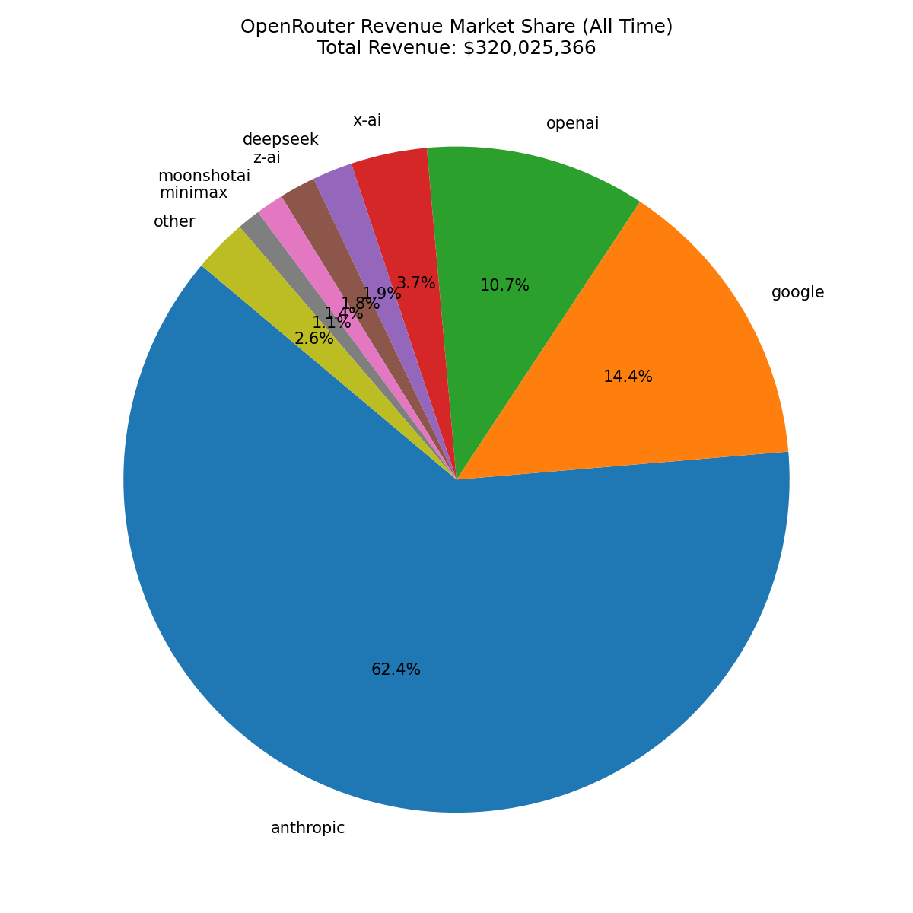

## Top 10 Models by Revenue — 2024

**Total estimated revenue across all models: $1,596,717**

| openrouter_id                             |   revenue |   attributed_prompt_tokens |   attributed_completion_tokens |   prompt_completion_ratio |   prompt_completion_reasoning_ratio |   attributed_reasoning_tokens |   prompt_price |   completion_price |   internal_reasoning_price |
|:------------------------------------------|----------:|---------------------------:|-------------------------------:|--------------------------:|------------------------------------:|------------------------------:|---------------:|-------------------:|---------------------------:|
| anthropic/claude-3.5-sonnet:beta          |    677110 |               206732885059 |                     3794095483 |                        54 |                                  54 |                             0 |       0.000003 |           0.000015 |                        nan |
| anthropic/claude-3.5-sonnet               |    496622 |               123683504286 |                     8371405160 |                        15 |                                  15 |                             0 |       0.000003 |           0.000015 |                        nan |
| anthropic/claude-3-opus                   |     41390 |                 1963264474 |                      159209823 |                        12 |                                  12 |                             0 |       0.000015 |           0.000075 |                        nan |
| anthropic/claude-3.5-sonnet-20240620:beta |     38307 |                 9134721587 |                      726872797 |                        13 |                                  13 |                             0 |       0.000003 |           0.000015 |                        nan |
| openai/gpt-4o                             |     34271 |                10096745561 |                      902895355 |                        11 |                                  11 |                             0 |       0.000003 |           0.000010 |                        nan |
| anthropic/claude-3.5-sonnet-20240620      |     22167 |                 4919966170 |                      493815910 |                        10 |                                  10 |                             0 |       0.000003 |           0.000015 |                        nan |
| openai/o1-preview                         |     21702 |                  890981007 |                      138956626 |                         6 |                                   6 |                             0 |       0.000015 |           0.000060 |                        nan |
| anthropic/claude-3-opus:beta              |     21579 |                 1013623018 |                       84994141 |                        12 |                                  12 |                             0 |       0.000015 |           0.000075 |                        nan |
| openai/gpt-4o-2024-11-20                  |     20746 |                 5171489069 |                      781758075 |                         7 |                                   7 |                             0 |       0.000003 |           0.000010 |                        nan |
| google/gemini-flash-1.5                   |     16825 |               107065840646 |                    29315889647 |                         4 |                                   4 |                             0 |       0.000000 |           0.000000 |                        nan |

### Revenue Market Share by Author — 2024

Authors accounting for less than 1% of total revenue are grouped into "Other".

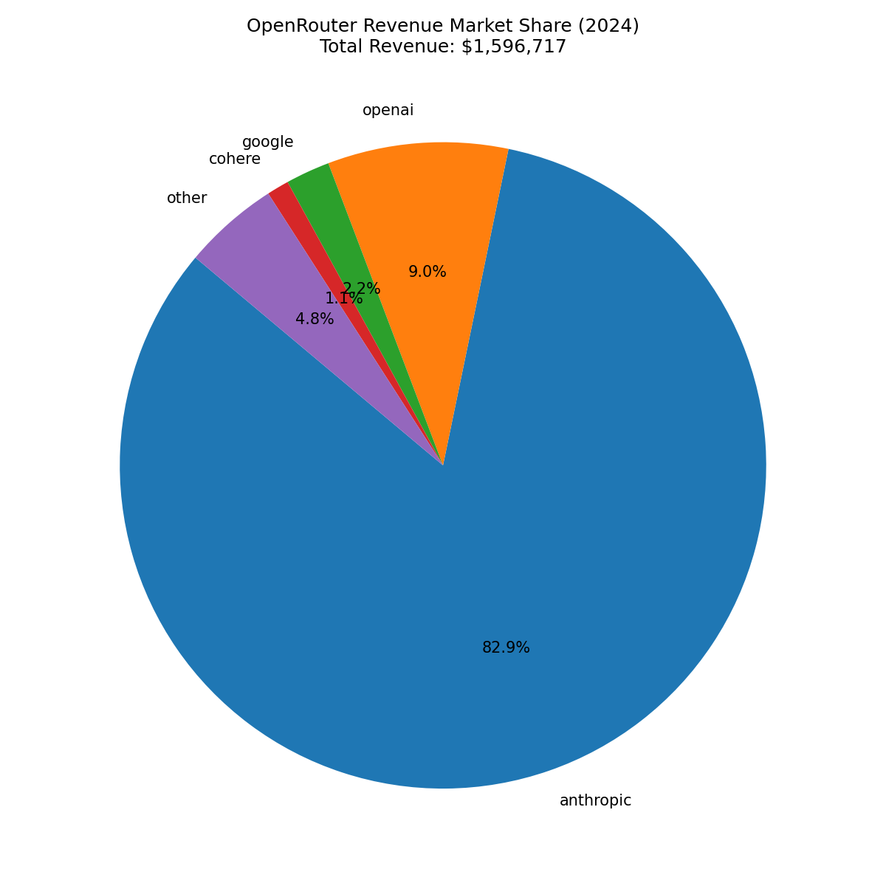

## Top 10 Models by Revenue — 2025

**Total estimated revenue across all models: $170,441,858**

| openrouter_id                        |   revenue |   attributed_prompt_tokens |   attributed_completion_tokens |   prompt_completion_ratio |   prompt_completion_reasoning_ratio |   attributed_reasoning_tokens |   prompt_price |   completion_price |   internal_reasoning_price |
|:-------------------------------------|----------:|---------------------------:|-------------------------------:|--------------------------:|------------------------------------:|------------------------------:|---------------:|-------------------:|---------------------------:|
| anthropic/claude-4-sonnet-20250522   |  33461910 |             10102522710239 |                   210289473166 |                        48 |                                  46 |                    8097590298 |       0.000003 |           0.000015 |                   0.000000 |
| anthropic/claude-4.5-sonnet-20250929 |  21186061 |              6414700965908 |                   129463850852 |                        50 |                                  46 |                   10172318968 |       0.000003 |           0.000015 |                   0.000000 |
| anthropic/claude-3-7-sonnet-20250219 |  20340361 |              5914954752955 |                   173033091397 |                        34 |                                  33 |                    5206009604 |       0.000003 |           0.000015 |                   0.000000 |
| anthropic/claude-3.5-sonnet          |  11368961 |              1688170954247 |                    41331164568 |                        41 |                                  41 |                             0 |       0.000006 |           0.000030 |                   0.000000 |
| google/gemini-2.5-pro                |   9760271 |              3839930631342 |                   496035817454 |                         8 |                                   5 |                  311039354740 |       0.000001 |           0.000010 |                   0.000000 |
| anthropic/claude-4-opus-20250522     |   5521621 |               326781619302 |                     8265285007 |                        40 |                                  38 |                     386967798 |       0.000015 |           0.000075 |                   0.000000 |
| anthropic/claude-4.5-opus-20251124   |   5442643 |               993083844304 |                    19088931196 |                        52 |                                  46 |                    2273372456 |       0.000005 |           0.000025 |                   0.000000 |
| anthropic/claude-4.1-opus-20250805   |   4932701 |               291540100557 |                     7461326200 |                        39 |                                  37 |                     497571222 |       0.000015 |           0.000075 |                   0.000000 |
| x-ai/grok-code-fast-1                |   4332167 |             19220198582270 |                   325418336764 |                        59 |                                  39 |                  166980607796 |       0.000000 |           0.000002 |                   0.000000 |
| google/gemini-2.5-flash              |   4088869 |              8422280322008 |                   624874001487 |                        13 |                                  12 |                   83759378057 |       0.000000 |           0.000003 |                   0.000000 |

### Revenue Market Share by Author — 2025

Authors accounting for less than 1% of total revenue are grouped into "Other".

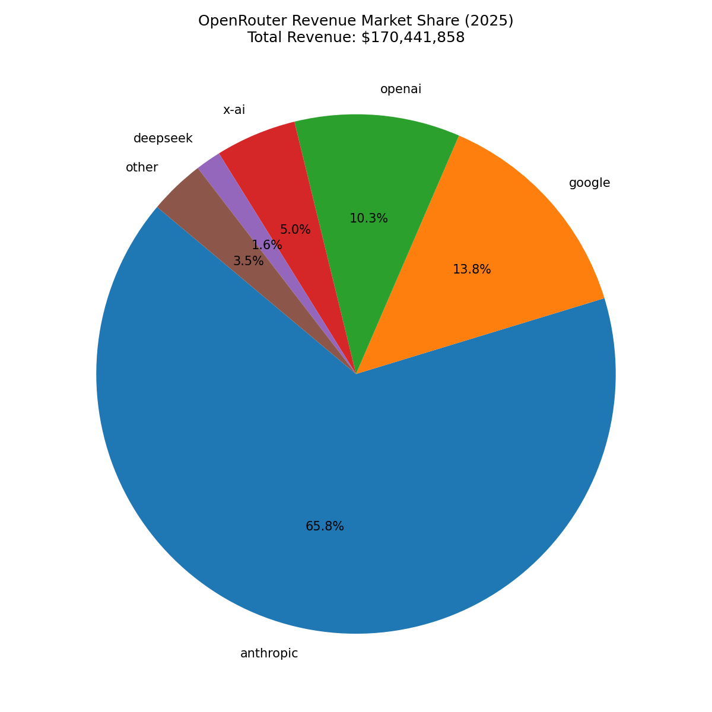

## Top 10 Models by Revenue — 2026

**Total estimated revenue across all models: $146,352,672**

| openrouter_id                          |   revenue |   attributed_prompt_tokens |   attributed_completion_tokens |   prompt_completion_ratio |   prompt_completion_reasoning_ratio |   attributed_reasoning_tokens |   prompt_price |   completion_price |   internal_reasoning_price |
|:---------------------------------------|----------:|---------------------------:|-------------------------------:|--------------------------:|------------------------------------:|------------------------------:|---------------:|-------------------:|---------------------------:|
| anthropic/claude-4.6-opus-20260205     |  25620803 |              4804959837348 |                    63840133563 |                        75 |                                  71 |                    3675405314 |       0.000005 |           0.000025 |                 nan        |
| anthropic/claude-4.5-sonnet-20250929   |  22962582 |              7010445150797 |                   128749790335 |                        54 |                                  52 |                    6726412053 |       0.000003 |           0.000015 |                   0.000000 |
| anthropic/claude-4.5-opus-20251124     |  17380597 |              3202511061269 |                    54721655684 |                        59 |                                  53 |                    5764676763 |       0.000005 |           0.000025 |                   0.000000 |
| anthropic/claude-4.6-sonnet-20260217   |  12115382 |              3771880210544 |                    53316115535 |                        71 |                                  67 |                    2680276180 |       0.000003 |           0.000015 |                 nan        |
| google/gemini-3-flash-preview-20251217 |   5778121 |              9010779023039 |                   424243913852 |                        21 |                                  18 |                   76794851169 |       0.000000 |           0.000003 |                   0.000003 |
| google/gemini-3-pro-preview-20251117   |   5287007 |              1508661760753 |                   189140284977 |                         8 |                                   5 |                  126847667539 |       0.000002 |           0.000012 |                   0.000012 |
| openai/gpt-5.2-20251211                |   4009681 |              1548898615015 |                    92793467154 |                        17 |                                  12 |                   40105182826 |       0.000002 |           0.000014 |                   0.000000 |
| google/gemini-2.5-pro                  |   3751497 |              1392391329163 |                   201100787408 |                         7 |                                   4 |                  121909622566 |       0.000001 |           0.000010 |                   0.000010 |
| moonshotai/kimi-k2.5-0127              |   3317597 |              6767898800430 |                   123655836836 |                        55 |                                  35 |                   70915307643 |       0.000000 |           0.000002 |                 nan        |
| google/gemini-3.1-pro-preview-20260219 |   2909057 |              1007092857530 |                    74572571119 |                        14 |                                   8 |                   54115364931 |       0.000002 |           0.000012 |                   0.000012 |

### Revenue Market Share by Author — 2026

Authors accounting for less than 1% of total revenue are grouped into "Other".

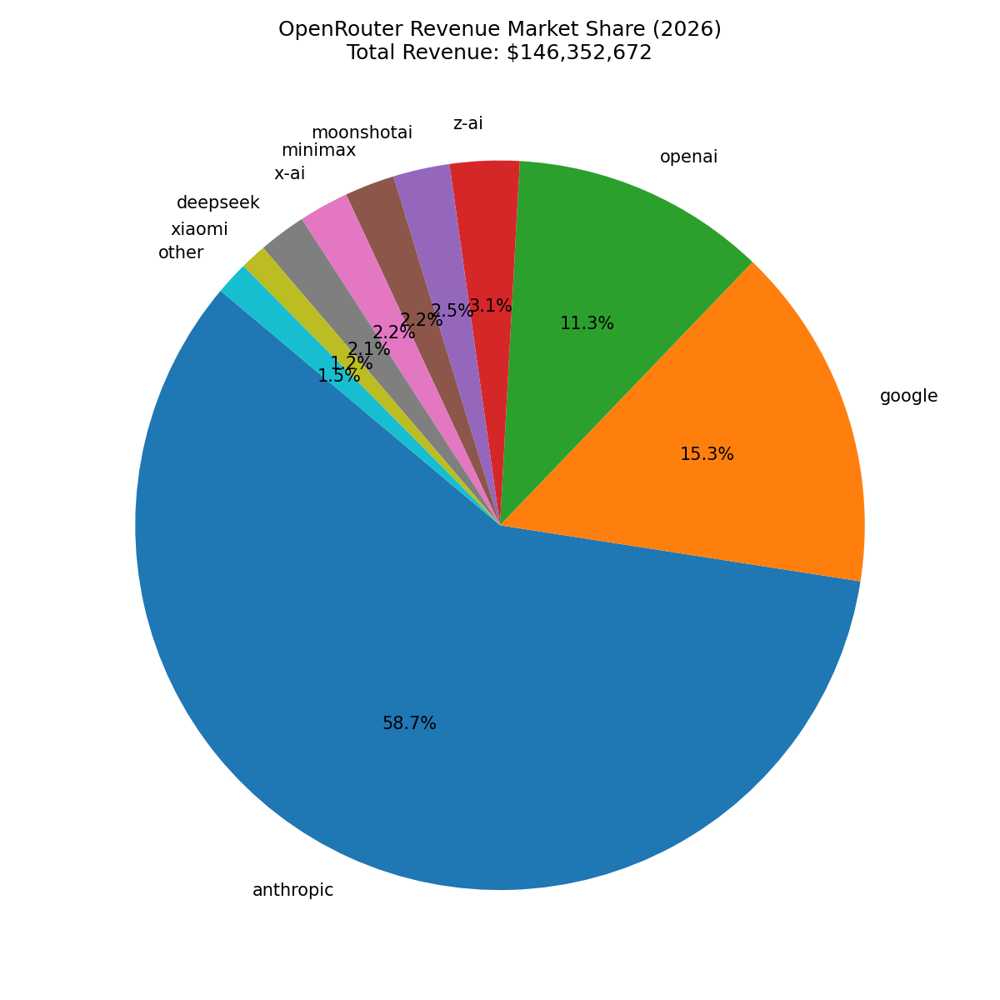

## Annual Revenue

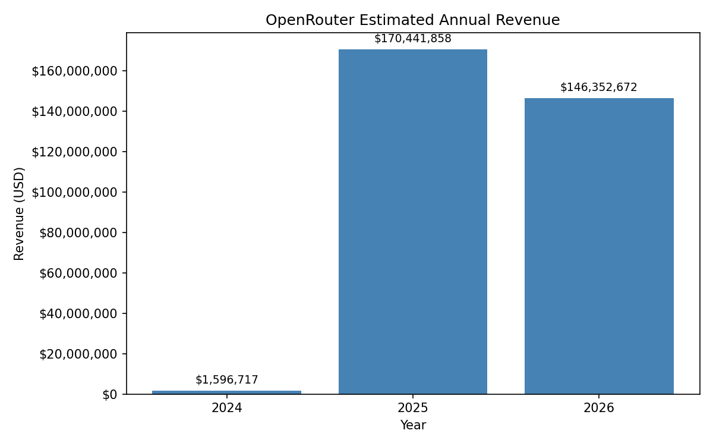

## Annualized Revenue

The chart below scales each year's revenue to a full year based on the calendar days actually covered by the data
(from the start of the first 7-day window to the end of the last 7-day window, clipped to the year).

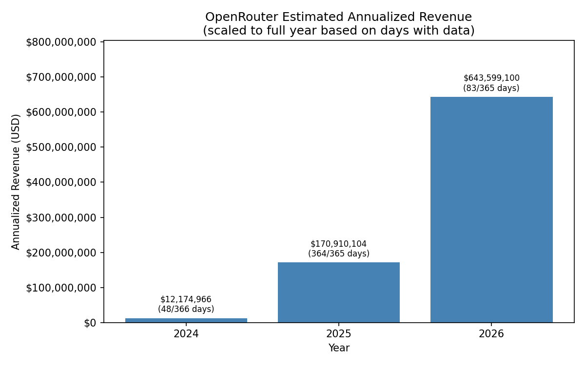

## Monthly Revenue by Region

Regional shares are from weekly survey data, linearly interpolated to monthly.
Total monthly revenue is split by region using these shares.

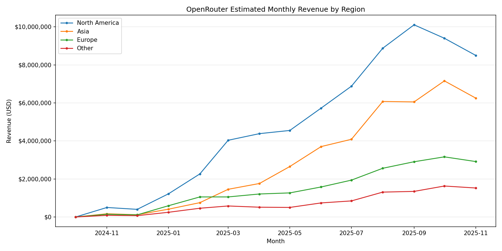

## Implied Total NA AI Market Over Time

Monthly NA revenue = total OpenRouter revenue × NA regional share.
Annualized market = (monthly NA revenue / assumed OpenRouter NA share) × 12.
Two scenarios: 0.3% (base) and 1.06% (upper bound).
Subscription anchor: $18.6B global annualized revenue in July 2025,
derived from OpenAI (35M subs, 5.8% at $200/mo)
at 68.7% market share, scaled by OpenRouter revenue growth and NA regional share.

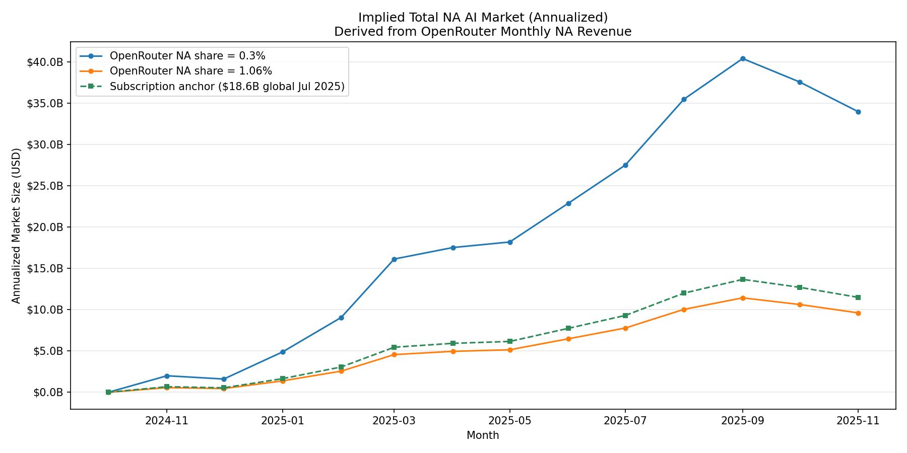

## Prompt vs Completion Token Usage

Each point is one model. Line of best fit: y = 11.26x + 9.02e+10.

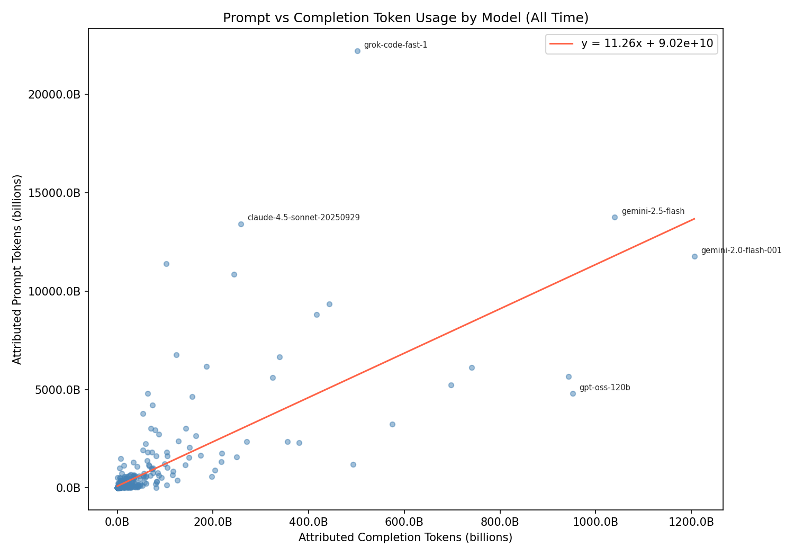

## North America Market Size Estimates by Author

Revenue share assumed to equal OpenRouter usage share. NA revenue = author OpenRouter revenue × avg NA share. Total market estimate = NA revenue / 0.3% (assumed OpenRouter share of NA market).

### H1 2025 (avg NA share: 51.6%)

**Total estimated NA AI market: $7,093,026,541**

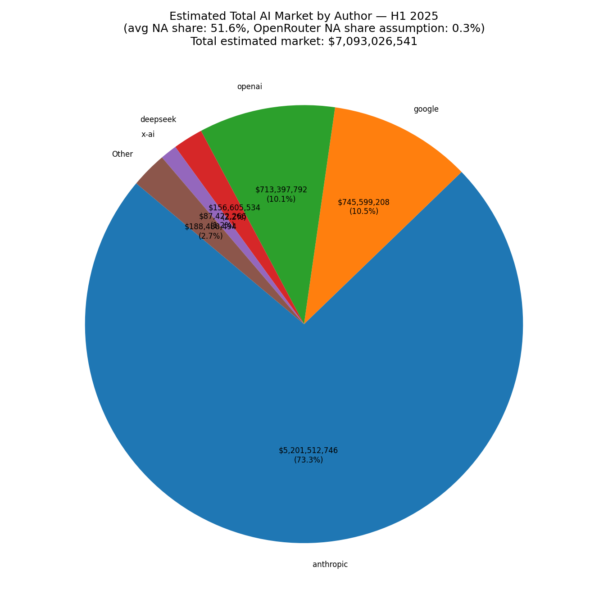

### H2 2025 (avg NA share: 47.2%)

**Total estimated NA AI market: $18,971,017,135**

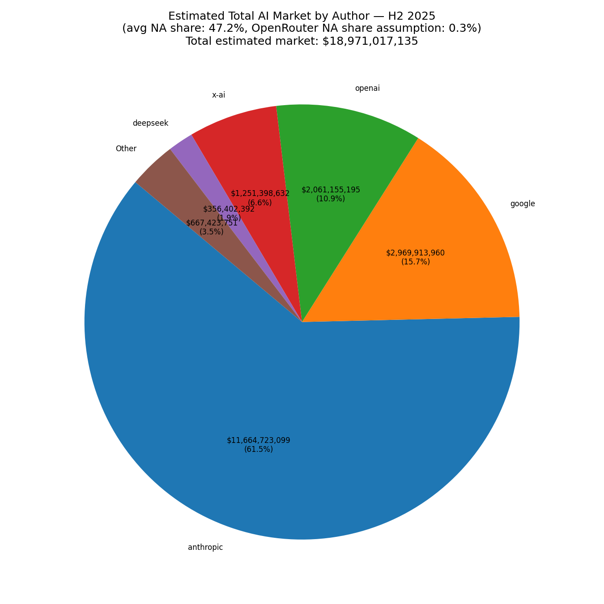
